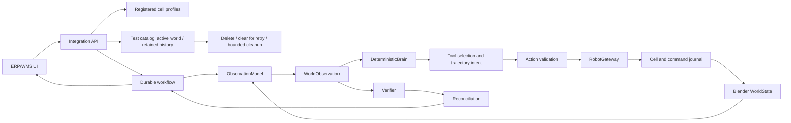

# RobotOps Twin

A deterministic warehouse robotics integration simulator with a durable workflow,
a synthetic Blender world, observations, verification and conservative recovery.

**Aktuell status:** Test deletion and same-test clearing accepted at audited source 0d03402: all 118 MUSTs PASS, 693 tests twice on Windows and Linux, 146 UI checks, nine browser journeys per suite and eight Blender demos. Delete removes the test and releases its number; Clear restores the same test for retry. CI, native launcher and publication verified; earlier failures remain archived. **DONE**.

[Acceptance evidence](ACCEPTANCE_REPORT.md) · [Progress](GOAL_PROGRESS.md) ·
[Plan](PROJECT_PLAN.md) · [Success criteria](SUCCESS_CRITERIA.md) ·
[Agent handoff](HANDOFF.md) · [Checklist](CODEX_GOAL_CHECKLIST.md)

The workspace now follows **Run a pick → notice its result → Investigate this pick**.
The investigation keeps the selected test/job and replay frame, separates symptoms
from confirmed records and possible explanations, and provides direct evidence,
manual inspection and a collapsed event timeline.
[Screenshots, repeated tests and release evidence](docs/evidence/investigation-ui-final/README.md)
and [the operator walkthrough](docs/implementation/investigation.md) show the flow.
Close and reopen the desktop app to load the updated UI; saved tests remain intact.

The implemented cell contains an original **HKM1800-inspired hybrid-kinematic
manipulator**, six distinct product families, six interchangeable tools, a tool
rack, destination tote/conveyor, enclosure and three camera viewpoints. The
deterministic Brain records why it selected a tool; validated segmented motion
visibly changes tools, picks, transfers and releases the product. Shared scene
geometry and recorded quaternion transforms drive Blender and read-only browser
replay. [The adaptation guide](docs/implementation/hkm-inspired.md) describes the
synthetic mechanics and conservative geometric checks.

Fresh API/desktop data uses this six-SKU profile. **Start new test** opens
**New simulation test**: choose **Robot cell**, then **Create test**. The
HKM-inspired cell is the only selectable cell today; the registry supports future
additions. Saved legacy tests retain their original Cartesian scene, command
hashes and evidence, and are labelled by their saved cell.
[Actual Blender evidence](docs/evidence/hkm-blender-local/result.json) covers the
six-tool showcase, attachment/release, uncertainty, restart and read-only replay.
[The baseline archive](docs/evidence/hkm-baseline-eaf35b4/provenance.json) preserves
the earlier release and the fresh baseline failure. Scoped development results
retain their original source attribution. The 110-MUST HKM acceptance belongs
to audited source `ca779879` and its publication successor `ae6d5d8`.
The cell-selection and test-data deletion revision passes all 110 MUSTs at clean
source `b1c374ae76144309cc4476392dec681292f0e3a7`.
[Historical acceptance](docs/evidence/investigation-ui-baseline/ACCEPTANCE_REPORT.txt) indexes its repeated local suites and
[independent CI/publication evidence](docs/evidence/test-management-final/README.md).
Final evidence/status successors receive their own exact-SHA CI and Pages checks.

This is an independent simulator inspired by public sources and general practice.
It does not reproduce SICS AI proprietary architecture or AGI. Blender supplies
synthetic visualization and test state, not validated robot dynamics, an exact
HKM1800 simulation or evidence of real-world robot performance. Logical E-stop is
an application interlock, not safety certification. No API key, model service,
GPU, real PLC or industrial hardware is required.

## Setup

Install [uv 0.12.13](https://docs.astral.sh/uv/getting-started/installation/) and
[Blender 5.2.1 LTS](https://download.blender.org/release/Blender5.2/).
Python 3.13.15 is selected by `.python-version`; uv can install it automatically.
Set `BLENDER_EXECUTABLE` to the Blender executable when it is not on PATH.
Install Node 20.17.0 and its npm for playback tests and dependency auditing.
Viewer assets are already vendored; no npm install is needed to run the app.
The standard Windows Blender 5.2 installation is also detected.

```sh
git clone https://github.com/raal1600/SICS-RobotOps-Twin-E2E-Warehouse-Robotics-Integration-Simulator.git
cd SICS-RobotOps-Twin-E2E-Warehouse-Robotics-Integration-Simulator
uv sync --locked --all-groups
uv run --locked python -m playwright install chromium --only-shell
uv run --locked python -m tools.dev demo
```

The last command initializes empty SQLite state and runs the deterministic
headless happy path. Every demo creates a fresh directory under `runs/` and prints
its evidence path. Existing evidence is never overwritten. Full tests require
actual Blender and fail explicitly if it is absent. PDF publication additionally
needs the system libraries documented in [PUBLICATION.md](PUBLICATION.md).

| Make command | Portable equivalent (including PowerShell) |
|---|---|
| `make setup` | The `uv sync` and Chromium-install commands above |
| `make test` | `uv run --locked python -m tools.dev test` |
| `make lint` | `uv run --locked python -m tools.dev lint` |
| `make typecheck` | `uv run --locked python -m tools.dev typecheck` |
| `make security` | `uv run --locked python -m tools.dev security` |
| `make demo` | `uv run --locked python -m tools.dev demo` |
| `make acceptance` | `uv run --locked python -m tools.dev acceptance` |
| `make docs` | `uv run --locked python -m tools.dev docs` |

Dependencies are pinned by `uv.lock`. Security auditing queries public advisory
databases during preflight; the mandatory runtime tests require no network after
installation. [Toolchain and reviewed exceptions](docs/implementation/dependencies.md).

## Demonstrations

### Windows desktop app

Double-click **RobotOps Twin** on your desktop to start its dashboard and Blender
runtime. Closing the app stops its owned processes; orders and evidence persist.
Build/install the launcher with
`powershell -NoProfile -ExecutionPolicy Bypass -File tools/build-desktop.ps1 -Install`.
It uses the existing local checkout, Python environment and Blender installation.
[Desktop lifecycle, data locations and tests](docs/implementation/desktop.md).

### Command-line demos

```sh
uv run --locked python -m tools.dev demo --runtime blender --scenario happy_path
uv run --locked python -m tools.dev demo --runtime blender --scenario lost_ack_after_effect
uv run --locked python -m tools.dev demo --runtime blender --scenario ambiguous
uv run --locked python -m tools.dev demo --runtime blender --scenario restart
uv run --locked python -m tools.dev demo --runtime blender --scenario tool_showcase
```

The lost-ack demo moves the product, loses the reply and persists UNKNOWN_OUTCOME.
Reconciliation queries the original command journal and obtains a fresh observation.
It completes only with sufficient evidence and proves one pick effect. Ambiguous
evidence produces REQUIRES_INTERVENTION. Further fixtures include
`lost_ack_before_effect`, `logical_estop` and `cell_fault`. `--runtime headless`
uses the same contracts with an atomic synthetic world for fast logic experiments.
The `tool_showcase` demo picks SKU-A through SKU-F with all six preferred tools,
verifies each job and records one product-transfer effect per original command.

```sh
uv run --locked python -m apps.api --runtime blender --data-dir runs/my-demo --port 8000
```

Open http://127.0.0.1:8000 for the local dashboard. The dark workspace guides you
through **Set up / Watch / Investigate / Continue**. Choose a product and scenario
in **Run a pick**, read its short purpose and **Watch for** line, then run it.
The cell and current result stay central; an amber guide and highlighted
**Investigate this pick** button point to unusual outcomes without covering the
animation automatically. Open it for **What happened**, **Evidence** and **Manual
inspection**. The panel separates symptoms, confirmed records and possible causes.
Exact command/journal, assessed observation, tool decision and JSON remain
available; the event timeline is collapsed and height-bounded.

Manual inspection provides scoped API requests, evidence/event download, recorded
fault reproduction guidance and real code/log locations. **Back to simulation**
keeps your replay selection and frame. Investigation pauses replay only; Play
resumes it. For an unresolved pick, **Sensor report for the next check** changes
only the next explicit reconciliation observation, never the product position.
Click the named review action to collect it; repeated unclear reports stay
investigable. Detailed choice definitions and comparisons remain expandable.
[Investigation walkthrough](docs/implementation/investigation.md) ·
[Scenario/observation definitions](docs/implementation/scenarios.md) ·
[Presentation boundary](docs/adr/0012-evidence-driven-investigation.md).
The saved Blender snapshot is available in the collapsed **Technical details**
section; the full 3D view and replay are the main visualization.
Reusing the data directory preserves state across restart.
Use **Start new test** at the top for any new execution/observation combination.
Choose **Robot cell** in the dialog, then **Create test**. It keeps both fault
selections, restores all products in an independent world and saves the previous
test unchanged. This works after success, failure, uncertainty or
intervention; a running operation must finish first. **Test history** opens saved
evidence and replay in the same window, read-only. **Return to current test**
resumes the active test. Startup recovers only that active world.

Under **Manage test data**:

- **Clear test and retry** keeps the selected test's number and cell, removes its
  old orders/evidence, restores all products and makes it current. Your scenario
  and observation choices stay selected, ready for another run.
- **Delete selected test** completely removes its saved world, evidence and test
  entry. **Delete all tests** removes the confirmed set. The next new test uses
  the first available number; after deleting everything it starts at **Test 1**.

Both ask for confirmation and perform no pick. Cancel preserves everything.
Other tests remain unchanged. Running work blocks these actions; interrupted
cleanup/reset is explicitly pending and resumes on retry or restart. Deleting
an active test leaves no active world and never promotes an archive. Clearing
an archive explicitly replaces its old results with a fresh current test.
[Lifecycle and recovery](docs/adr/0013-reusable-test-lifecycle.md) describe the
bounded cleanup, revision fencing and anonymous retry guards. No deleted test
record is retained after cleanup finishes.

Changing **Execution scenario** changes the next order's configuration only.
**Restock this test → Start fresh scene** restores products within a resolved
test; unresolved jobs still block it. **Reset logical cell state** does not move products.
When all products are picked, the main button offers **Start new delivery and run
order**. **Full delivery (all products)** replays every execution in the selected
scene; **Choose delivery or product replay** exposes current or saved deliveries, and individual
product replay remains available.
**Run six-tool showcase (happy path)** runs that same six-product sequence in the
app. **Why this tool?** exposes persisted candidate scores and constraint reasons.

After a lost acknowledgement, the **Next step** card names the unresolved product
and offers its review action. Open it, select **Normal observation**, and use
**Reconcile [product]** to check that original pick before running another product.
Each pick in the lost-ack scenario needs this step. Contradictory or insufficient
evidence pauses the next pick but allows **Observe again and reconcile** in the
same test. Choose an observation mode and try again; **Normal observation**
removes the injected degradation for that new capture. Each attempt checks the
original command and stays in the timeline. Sufficient evidence resolves the job
and unlocks the next explicit order; inconclusive evidence keeps it paused.
No new pick is sent by observation. Restart leaves intervention paused.
You can always start an independent test with **Start new test**; the previous
uncertain/intervention outcome remains recorded and is never labelled resolved.

**The robotic cell** shows the 3D environment, machine and products.
Orbit, pan and zoom around the cell. Orders with an effect move the machine and
product using recorded Blender poses; blocked orders replay their events with
the saved starting scene held still. Play/pause, scrubbing and speed affect only
the view. Operator, Overhead, Side inspection and Follow TCP are presentation
views; frame stepping and speeds from 0.25x to 4x never change execution evidence.
Replay sends no new pick. Software 3D remains available without WebGL.
For older orders, **Load saved animation** reads their original `.blend`.
[Playback behavior and evidence boundary](docs/implementation/playback.md).
`/metrics` exposes persisted job, command, tool, observation, trajectory and
reconciliation counts, with application latency separate from synthetic motion
duration; `/docs` exposes OpenAPI.
This local demo API has no production authentication and binds to loopback.

## Architecture



The verifier accepts observations, never simulator ground truth. Duplicate command
delivery preserves identity and cannot repeat the effect. Fenced durable claims
serialize the cell; lease expiry does not prove that motion failed. A fixed Blender
script and typed JSON form the runtime boundary. Missing/corrupt checkpoints remain
uncertain. No natural-language MCP execution or generated code controls the runtime.

| Code / contract | Documentation |
|---|---|
| `apps/api/`, `apps/erp_ui/` | [Operations, API and metrics](docs/implementation/operations.md) |
| `robotops/domain/`, `contracts/` | [Versioned contracts](docs/implementation/contracts.md) |
| `robotops/robotics/`, `robotops/hkm_geometry.py` | [HKM-inspired cell and tool catalogue](docs/implementation/hkm-inspired.md) |
| `robotops/workflow/` | [Persistence and fenced claims](docs/implementation/persistence.md) |
| `robotops/brain/`, `robotops/verification/`, `robotops/observation/` | [Validation and reconciliation](docs/implementation/reconciliation.md) |
| `robotops/cell/`, `robotops/robot_gateway/` | [Journal and fault semantics](docs/implementation/runtime.md) |
| `robotops/blender/`, `blender/scripts/` | [Bounded Blender runtime](docs/implementation/blender.md) |
| `apps/erp_ui/playback.js`, `scene-view.js`, `apps/api/playback.py` | [3D scenario replay](docs/implementation/playback.md) |
| `tests/`, `tools/`, `.github/workflows/` | [Acceptance process](docs/implementation/acceptance.md) |

Material design decisions are recorded in [ADR 0001](docs/adr/0001-durable-synthetic-boundaries.md).
Optional model assistance, OPC UA, external ERP delivery, realistic physics and real
hardware remain a non-blocking backlog. They are not implemented or validated.

## Research and publication

[GitHub Pages](https://raal1600.github.io/SICS-RobotOps-Twin-E2E-Warehouse-Robotics-Integration-Simulator/)
hosts documentation only. Current deployment identity appears in `build.json`.
Local implementation does not imply the public site has been deployed.

| Editable source | Published report |
|---|---|
| [Design and research](reports/01-design.md) | [Design study](https://raal1600.github.io/SICS-RobotOps-Twin-E2E-Warehouse-Robotics-Integration-Simulator/design.html) |
| [Scope and transfer limits](reports/02-avgransning.md) | [Scope](https://raal1600.github.io/SICS-RobotOps-Twin-E2E-Warehouse-Robotics-Integration-Simulator/avgransning.html) |
| [Technical discussion](reports/03-diskussion.md) | [Discussion](https://raal1600.github.io/SICS-RobotOps-Twin-E2E-Warehouse-Robotics-Integration-Simulator/diskussion.html) |

[Source registry](publication/references.json) and [diagram definitions](publication/diagrams.json)
distinguish independently verified public facts, company-reported claims, general
practice and our simulator design. Research is not acceptance evidence. All generated
HTML, SVG and PDFs are rebuilt from sources via [PUBLICATION.md](PUBLICATION.md).
No private recruitment messages, credentials or proprietary code are part of this project.

Rami Halabi · AI-assisted code, research text and publication · [MIT license](LICENSE).
