# RobotOps Twin

A deterministic warehouse robotics integration simulator with a durable workflow,
a synthetic Blender world, observations, verification and conservative recovery.

**Aktuell status:** The deterministic E2E simulator, CPU Blender adapter, dashboard and persisted observability are implemented. Two full local suite runs, seven Blender scenarios, security and publication builds pass. Clean-checkout verification and final-SHA remote CI/Pages gates remain to be completed. **NOT DONE** until all MUST criteria and remote workflows pass.

[Acceptance evidence](ACCEPTANCE_REPORT.md) · [Progress](GOAL_PROGRESS.md) ·
[Plan](PROJECT_PLAN.md) · [Success criteria](SUCCESS_CRITERIA.md) ·
[Agent handoff](HANDOFF.md) · [Checklist](CODEX_GOAL_CHECKLIST.md)

This is an independent simulator inspired by public sources and general practice.
It does not reproduce SICS AI proprietary architecture or AGI. Blender supplies
synthetic visualization and test state, not validated robot dynamics, an exact
HKM1800 simulation or evidence of real-world robot performance. Logical E-stop is
an application interlock, not safety certification. No API key, model service,
GPU, real PLC or industrial hardware is required.

## Setup

Install [uv 0.12.13](https://docs.astral.sh/uv/getting-started/installation/) and
[Blender 5.2.1 LTS](https://download.blender.org/release/Blender5.2/).
Python 3.13.15 is selected by `.python-version`; uv can install it automatically.
Set `BLENDER_EXECUTABLE` to the Blender executable when it is not on PATH.
The standard Windows Blender 5.2 installation is also detected.

```sh
git clone https://github.com/raal1600/SICS-RobotOps-Twin-E2E-Warehouse-Robotics-Integration-Simulator.git
cd SICS-RobotOps-Twin-E2E-Warehouse-Robotics-Integration-Simulator
uv sync --locked --all-groups
uv run --locked python -m tools.dev demo
```

The last command initializes empty SQLite state and runs the deterministic
headless happy path. Every demo creates a fresh directory under `runs/` and prints
its evidence path. Existing evidence is never overwritten. Full tests require
actual Blender and fail explicitly if it is absent. PDF publication additionally
needs the system libraries documented in [PUBLICATION.md](PUBLICATION.md).

| Make command | Portable equivalent (including PowerShell) |
|---|---|
| `make setup` | `uv sync --locked --all-groups` |
| `make test` | `uv run --locked python -m tools.dev test` |
| `make lint` | `uv run --locked python -m tools.dev lint` |
| `make typecheck` | `uv run --locked python -m tools.dev typecheck` |
| `make security` | `uv run --locked python -m tools.dev security` |
| `make demo` | `uv run --locked python -m tools.dev demo` |
| `make acceptance` | `uv run --locked python -m tools.dev acceptance` |
| `make docs` | `uv run --locked python -m tools.dev docs` |

Dependencies are pinned by `uv.lock`. Security auditing queries public advisory
databases during preflight; the mandatory runtime tests require no network after
installation. [Toolchain and reviewed exceptions](docs/implementation/dependencies.md).

## Demonstrations

```sh
uv run --locked python -m tools.dev demo --runtime blender --scenario happy_path
uv run --locked python -m tools.dev demo --runtime blender --scenario lost_ack_after_effect
uv run --locked python -m tools.dev demo --runtime blender --scenario ambiguous
uv run --locked python -m tools.dev demo --runtime blender --scenario restart
```

The lost-ack demo moves the product, loses the reply and persists UNKNOWN_OUTCOME.
Reconciliation queries the original command journal and obtains a fresh observation.
It completes only with sufficient evidence and proves one pick effect. Ambiguous
evidence produces REQUIRES_INTERVENTION. Further fixtures include
`lost_ack_before_effect`, `logical_estop` and `cell_fault`. `--runtime headless`
uses the same contracts with an atomic synthetic world for fast logic experiments.

```sh
uv run --locked python -m apps.api --runtime blender --data-dir runs/my-demo --port 8000
```

Open http://127.0.0.1:8000 for the local ERP dashboard. Select a product and fault,
run the order, inspect job/cell status, observation, verifier and timeline, then
reconcile uncertain work. Reusing the data directory preserves state across restart.
`/metrics` exposes persisted counts and pipeline latency; `/docs` exposes OpenAPI.
This local demo API has no production authentication and binds to loopback.

## Architecture

```mermaid
flowchart LR
    ERP[ERP/WMS UI] --> API[Integration API]
    API --> WF[Durable workflow]
    WF --> B[DeterministicBrain]
    B --> V[Action validation]
    V --> G[RobotGateway]
    G --> C[Cell and command journal]
    C --> W[Blender WorldState]
    W --> O[ObservationModel]
    O --> WO[WorldObservation]
    WO --> VERIFY[Verifier]
    VERIFY --> R[Reconciliation]
    R --> WF
    WF --> ERP
```



The verifier accepts observations, never simulator ground truth. Duplicate command
delivery preserves identity and cannot repeat the effect. Fenced durable claims
serialize the cell; lease expiry does not prove that motion failed. A fixed Blender
script and typed JSON form the runtime boundary. Missing/corrupt checkpoints remain
uncertain. No natural-language MCP execution or generated code controls the runtime.

| Code / contract | Documentation |
|---|---|
| `apps/api/`, `apps/erp_ui/` | [Operations, API and metrics](docs/implementation/operations.md) |
| `robotops/domain/`, `contracts/` | [Versioned contracts](docs/implementation/contracts.md) |
| `robotops/workflow/` | [Persistence and fenced claims](docs/implementation/persistence.md) |
| `robotops/brain/`, `robotops/verification/`, `robotops/observation/` | [Validation and reconciliation](docs/implementation/reconciliation.md) |
| `robotops/cell/`, `robotops/robot_gateway/` | [Journal and fault semantics](docs/implementation/runtime.md) |
| `robotops/blender/`, `blender/scripts/` | [Bounded Blender runtime](docs/implementation/blender.md) |
| `tests/`, `tools/`, `.github/workflows/` | [Acceptance process](docs/implementation/acceptance.md) |

Material design decisions are recorded in [ADR 0001](docs/adr/0001-durable-synthetic-boundaries.md).
Optional model assistance, OPC UA, external ERP delivery, realistic physics and real
hardware remain a non-blocking backlog. They are not implemented or validated.

## Research and publication

[GitHub Pages](https://raal1600.github.io/SICS-RobotOps-Twin-E2E-Warehouse-Robotics-Integration-Simulator/)
hosts documentation only. Current deployment identity appears in `build.json`.
Local implementation does not imply the public site has been deployed.

| Editable source | Published report |
|---|---|
| [Design and research](reports/01-design.md) | [Design study](https://raal1600.github.io/SICS-RobotOps-Twin-E2E-Warehouse-Robotics-Integration-Simulator/design.html) |
| [Scope and transfer limits](reports/02-avgransning.md) | [Scope](https://raal1600.github.io/SICS-RobotOps-Twin-E2E-Warehouse-Robotics-Integration-Simulator/avgransning.html) |
| [Technical discussion](reports/03-diskussion.md) | [Discussion](https://raal1600.github.io/SICS-RobotOps-Twin-E2E-Warehouse-Robotics-Integration-Simulator/diskussion.html) |

[Source registry](publication/references.json) and [diagram definitions](publication/diagrams.json)
distinguish independently verified public facts, company-reported claims, general
practice and our simulator design. Research is not acceptance evidence. All generated
HTML, SVG and PDFs are rebuilt from sources via [PUBLICATION.md](PUBLICATION.md).
No private recruitment messages, credentials or proprietary code are part of this project.

Rami Halabi · AI-assisted code, research text and publication · [MIT license](LICENSE).
