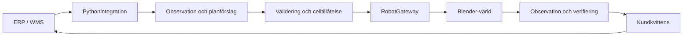

# RobotOps Twin

### End-to-End Warehouse Robotics Integration Simulator — forsknings- och designunderlag

**[Öppna rapportpaketet på GitHub Pages](https://raal1600.github.io/SICS-RobotOps-Twin-E2E-Warehouse-Robotics-Integration-Simulator/)**

[](https://github.com/raal1600/SICS-RobotOps-Twin-E2E-Warehouse-Robotics-Integration-Simulator/actions/workflows/publish-reports.yml)

Ett oberoende, svenskt rapportpaket om hur kundens lagerorder kan kopplas till AI-assisterad robotexekvering, verifiering och återhämtning. Blender är den **planerade simulatorvärlden**, inte en validerad kopia av en verklig anläggning.

**Aktuell status:** The deterministic headless E2E workflow is implemented and tested: local Brain, semantic validation, durable journals, degraded observations, conservative reconciliation, process-crash recovery and deterministic demos. Blender runtime and dashboard/publication acceptance remain in progress. **NOT DONE** until all MUST criteria and remote workflows pass.

## Läs och ladda ned

| Rapport | Webb | PDF |
|---|---|---|
| 01. Från kundorder till verifierad roboteffekt | [Designstudie](https://raal1600.github.io/SICS-RobotOps-Twin-E2E-Warehouse-Robotics-Integration-Simulator/design.html) | [Ladda ned](https://raal1600.github.io/SICS-RobotOps-Twin-E2E-Warehouse-Robotics-Integration-Simulator/downloads/01-design.pdf) |
| 02. Simulatorn och den verkliga robotcellen | [Avgränsning](https://raal1600.github.io/SICS-RobotOps-Twin-E2E-Warehouse-Robotics-Integration-Simulator/avgransning.html) | [Ladda ned](https://raal1600.github.io/SICS-RobotOps-Twin-E2E-Warehouse-Robotics-Integration-Simulator/downloads/02-avgransning.pdf) |
| 03. Teknisk dialog om RobotOps Twin | [Diskussionsunderlag](https://raal1600.github.io/SICS-RobotOps-Twin-E2E-Warehouse-Robotics-Integration-Simulator/diskussion.html) | [Ladda ned](https://raal1600.github.io/SICS-RobotOps-Twin-E2E-Warehouse-Robotics-Integration-Simulator/downloads/03-diskussion.pdf) |

**[Alla tre rapporterna i en PDF](https://raal1600.github.io/SICS-RobotOps-Twin-E2E-Warehouse-Robotics-Integration-Simulator/downloads/robotops-twin-samlat.pdf)** · [Diagramgalleri](https://raal1600.github.io/SICS-RobotOps-Twin-E2E-Warehouse-Robotics-Integration-Simulator/diagram.html) · [Källregister](https://raal1600.github.io/SICS-RobotOps-Twin-E2E-Warehouse-Robotics-Integration-Simulator/kallor.html)

PDF-filer och färdig webbplats finns också i den genererade [gh-pages-grenen](https://github.com/raal1600/SICS-RobotOps-Twin-E2E-Warehouse-Robotics-Integration-Simulator/tree/gh-pages). Publiceringshistorik och HTTP-kontroller finns i Actions.

## Implementation contract and Codex handoff

The implementation is governed by four English documents intended for an autonomous Codex `/goal` loop:

- [PROJECT_PLAN.md](PROJECT_PLAN.md) — normative architecture, contracts, state/recovery semantics, implementation phases and knowledge-base synchronization protocol.
- [SUCCESS_CRITERIA.md](SUCCESS_CRITERIA.md) — normative machine-checkable acceptance contract. **DONE requires every MUST criterion to pass with inspectable evidence.**
- [HANDOFF.md](HANDOFF.md) — exact `/goal` prompt, mandatory read order, iteration algorithm, anti-shortcut rules, escalation conditions, milestone discipline and final release checklist.
- [CODEX_GOAL_CHECKLIST.md](CODEX_GOAL_CHECKLIST.md) — operational checklist derived from the normative plan and criteria; it does not weaken them.

[GOAL_PROGRESS.md](GOAL_PROGRESS.md) and [ACCEPTANCE_REPORT.md](ACCEPTANCE_REPORT.md) track progress and evidence. Status remains NOT DONE until every MUST passes. Any architecture, API, schema, state-machine, source, command or project-status change that makes existing documentation stale must update all affected knowledge-base source documents and diagrams in the same coherent change. Generated Pages/PDFs are rebuilt through the publication workflow rather than edited manually.

## Konceptet



Huvudfallet är ett plock som genomförs medan kvittensen försvinner. Systemet ska då inte anta att handlingen uteblev. Det ska markera okänt utfall och stämma av journal och observation utan ett omotiverat nytt plock. Otillräcklig evidens ska kunna leda till granskning i stället för ett falskt grönt resultat.

## Underlag och avgränsning

Rapporterna skiljer offentliga uppgifter, självrapporterade företagsresultat, egna designbeslut och kunskapsluckor. Inspirationen kommer bland annat från CloudGripper/AutoGrasper, R900, SICS AI:s offentliga roll- och HYPER-material samt Cognibotics installationsbeskrivning. Källorna är spårbara; ingen proprietär robotbrain eller AGI-implementation påstås vara återskapad.

Sju originaldiagram kan redigeras som Mermaid eller via JSON-layouten. Källkod och text är AI-assisterade. Rapportpaketet är inte sakkunniggranskat. Inga privata rekryteringsmeddelanden eller interna företagsdokument publiceras.

## Bygg dokumentationen lokalt

```bash
python -m venv .venv
source .venv/bin/activate
python -m pip install -r requirements-docs.txt
python tools/build_publication.py
python -m http.server 8000 --directory _site
```

Python 3.13 och Pango/DejaVu behövs. Se [PUBLICATION.md](PUBLICATION.md) för systemberoenden, publicering och visuell kvalitetskontroll. GitHub Pages kör enbart dokumentationen, inte Blender eller Pythonbackend.

## Struktur

```text
reports/                 Tre redigerbara Markdown-rapporter
publication/             Källregister, diagramlayout och CSS
 tools/build_publication.py   HTML-, SVG-, Mermaid- och PDF-bygge
.github/workflows/       Bygge, publicering och HTTP-kontroll
CITATION.cff             Citeringsmetadata
PUBLICATION.md           Underhålls- och publiceringsguide
PROJECT_PLAN.md           Normativ implementation plan
SUCCESS_CRITERIA.md       Normativ acceptance contract
HANDOFF.md                Codex /goal operating contract
CODEX_GOAL_CHECKLIST.md   Operational implementation checklist
```

Rami Halabi · Version 1.0 · 1 oktober 2026. Befintlig [MIT-licens](LICENSE) behålls. Länkade källor och varumärken tillhör respektive rättighetsinnehavare.

## Development toolchain

Install uv, then run `uv sync --locked --all-groups` (equivalent to `make setup`).
Run `uv run --locked python -m tools.dev test`, `lint`, or `typecheck`.
JSON schemas and OpenAPI: `uv run --locked python -m tools.dev contracts`.
Publication: `uv run --locked python -m tools.dev docs`; Pango is required.
Run `uv run --locked python -m tools.dev demo` for happy path. Add `--scenario lost_ack_after_effect`, `--scenario ambiguous`, or `--scenario restart`. Each run saves inspectable evidence under runs/. The acceptance command is still in progress.
See [dependency policy](docs/implementation/dependencies.md),
[contracts](docs/implementation/contracts.md) and [ADR 0001](docs/adr/0001-durable-synthetic-boundaries.md).

Persistence details: [durable state and claims](docs/implementation/persistence.md).

[Runtime journal and fault semantics](docs/implementation/runtime.md).

[Observation and reconciliation decision table](docs/implementation/reconciliation.md).
