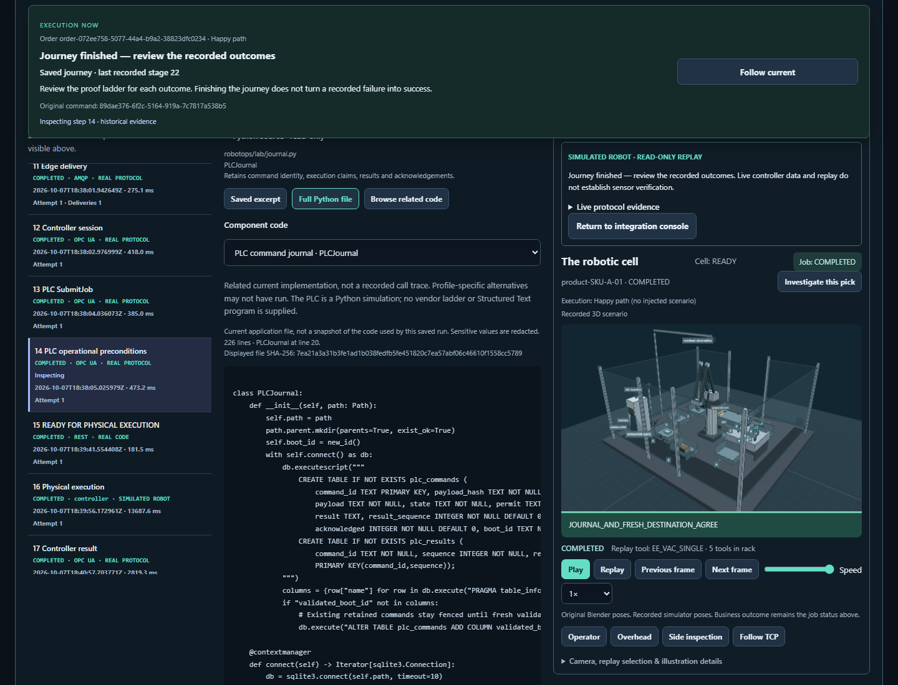
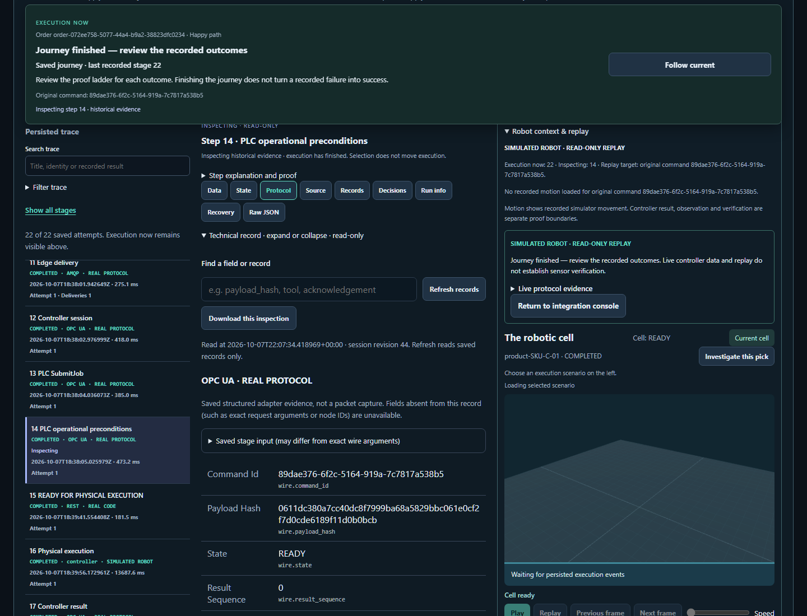
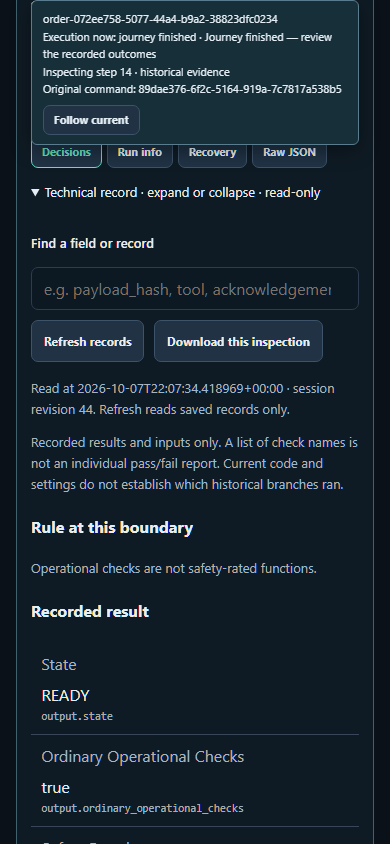

# Engineering inspector follow-up

This snapshot extends the evidence workbench with a related-code browser, readable
protocol fields, linked storage records, recorded decisions, and run provenance.
See the [implementation and usage guide](../../implementation/engineering-inspector.md).

The source browser now reaches the actual lab edge process, OPC UA client/server,
virtual PLC journal, broker delivery, PostgreSQL transactions, planning/validation,
robot runtimes, verification and WMS implementation. Related code is explicitly
current reference material, not a captured call trace. Saved excerpts remain intact.

Records distinguish immutable evidence from rows read now. Decision views avoid
inventing individual check outcomes. Run info identifies unavailable historical
build/configuration snapshots. Engineering reads do not query or execute the robot.

Validation evidence in this directory:

- `ui-tests.txt`: **171 UI tests passed**, including stale step/component responses,
  unknown-source errors and retry, and the existing authority/proof/replay checks.
- `browser.xml`: **5 browser tests passed** after the compact inspector change,
  covering new engineering views/downloads, source code, two cursors, execution
  consent and WMS-only recovery at desktop and mobile widths.
- `backend.xml`: broader run with **233 passed** and one documentation-link failure
  because this README was being written. A subsequent contract run caught the
  three screenshot links before their files had been copied (retained in
  `contracts-during-assembly.xml`). The pack was completed and the contract suite
  rerun; `contracts-final.xml` records the corrected result.
- Ruff, mypy for the three backend files, JavaScript syntax and diff whitespace
  checks passed. FastAPI emits an existing TestClient/httpx deprecation warning.
- `live-api-review.json`: 18 inspection reads across all three saved Blender lab
  runs; controller stages also checked all five PLC/edge source selections.
- `browser-review.json`: live desktop/mobile review, original-command playback,
  readable historical WMS 503 evidence after recovery, zero POSTs/browser errors.
- `saved-run-preservation.json`: all three saved sessions (including every step,
  revision and original command identity) were unchanged by restart and inspection.
- `recording-review.json`: completed read-only walkthrough of the improved views
  and original Blender replay. It does not represent a new physical execution.

The walkthrough is stored locally at
`artifacts/engineering-review/engineering-console-demo.webm` (68.16 seconds,
1440 × 1100). It covers broker publication, durable inbox, OPC UA, PLC server/client
and journal code, original robot replay, verification, WMS and run information.
Chromium playback metadata and seek checks are retained in `video-playback.json`.

`manifest.json` hashes the relevant source files and retained evidence. It describes
the current uncommitted working tree, not a historical build of the saved runs.
Earlier [workbench](../workbench-20261007/README.md) and
[source-view](../source-view-20261007/README.md) packs remain historical snapshots.
