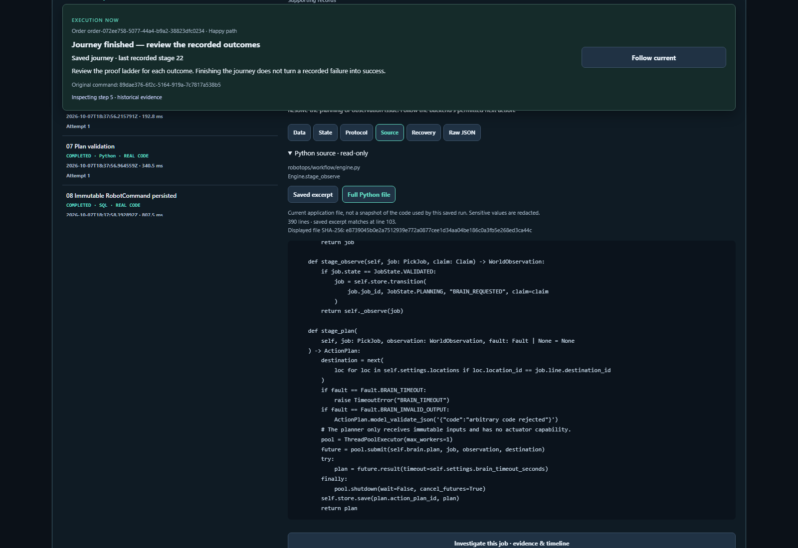
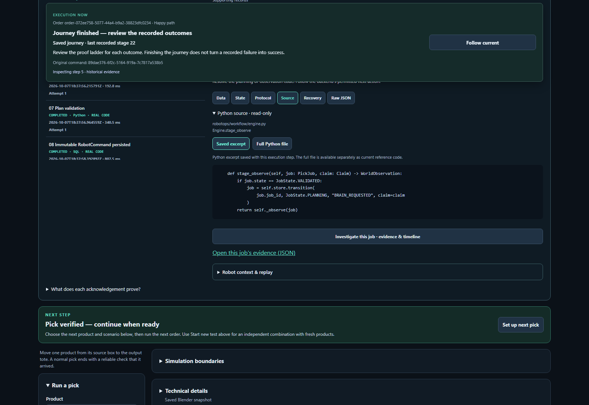

# Readable Python Source follow-up

Source previously serialized `{path, symbol, excerpt}` as JSON. That hid Python
line breaks behind escapes and exposed only the existing eight-line saved excerpt.
The tab now displays that excerpt as code, with the path and function above it.
**Full Python file** loads the complete current script and scrolls to the matching
excerpt. **Saved excerpt** returns to the execution-time record.

The current file is explicitly labelled as current reference material, not a
historical source snapshot. It includes a line count, matching-excerpt line when
available, and SHA-256 of the displayed sanitized content. Missing files are
reported as unavailable while the saved excerpt remains accessible. Switching
stages cannot allow a late response to replace another stage's code. Raw JSON
continues to expose the original source-reference object.

The additive read-only route is
`GET /integration/sessions/{session_id}/steps/{step_id}/source`. It resolves a saved
step, serves only the known stage source-file allowlist, verifies repository path
containment and redacts sensitive values. It does not execute Python or mutate
session/workflow state. No stored source record or database schema was changed.

Changed components: `apps/erp_ui/integration-console.js`, `index.html`, `theme.css`,
`apps/api/guided.py`, new `robotops/integration/source.py`, generated OpenAPI,
UI tests, a browser Source-view test and new `tests/integration/test_guided_source.py`.

Validation:

- All UI tests: **169 passed**, including readable excerpt/current-file switching,
  raw-record retention, missing-file behavior and late-response isolation.
- Source endpoint/reader and API/schema tests: **74 passed**, including unchanged
  revision/world state, full-file content/hash, unknown step, path allowlist,
  sanitization and missing files.
- Focused browser test: **1 passed**, checking actual code text, full-file loading,
  390px layout without horizontal page overflow and zero mutation requests.
- Ruff, mypy (seven source files), JavaScript syntax and whitespace checks passed.
- Manual review in the local distributed lab: selected step 5 of saved session
  `3686df7c-817c-59c2-8f89-132c7eea58fa`, viewed `Engine.stage_observe`, opened the
  full 390-line file at the matching excerpt (line 103), then returned to the saved
  excerpt. Zero POST requests and browser errors. The original 133-frame robot
  recording still loaded with command `89dae376-6f2c-5164-919a-7c7817a538b5`.

The local lab was reloaded using the same PostgreSQL schema, queue and data
directory. All three saved session identities, revisions, commands and outcomes
matched before and after. PostgreSQL/RabbitMQ services were retained.

`backend.xml`, `browser.xml`, `ui-tests.txt`, `review.json`, `before-reload.json`
and `after-reload.json` retain the validation evidence. `manifest.json` identifies
this follow-up source/artifact snapshot. The earlier
[workbench pack](../workbench-20261007/README.md) remains a separate historical
review snapshot and its test/source hashes have not been relabelled as this fix.
