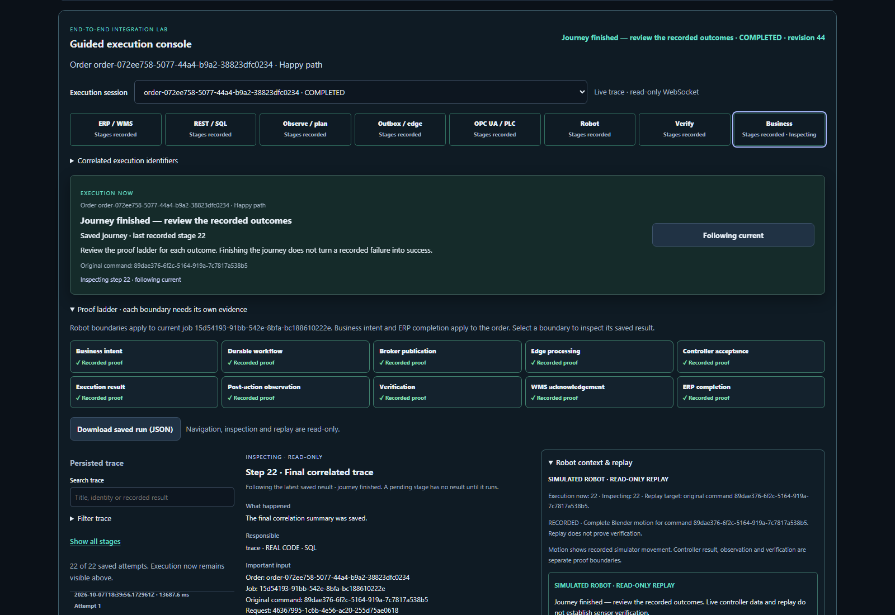
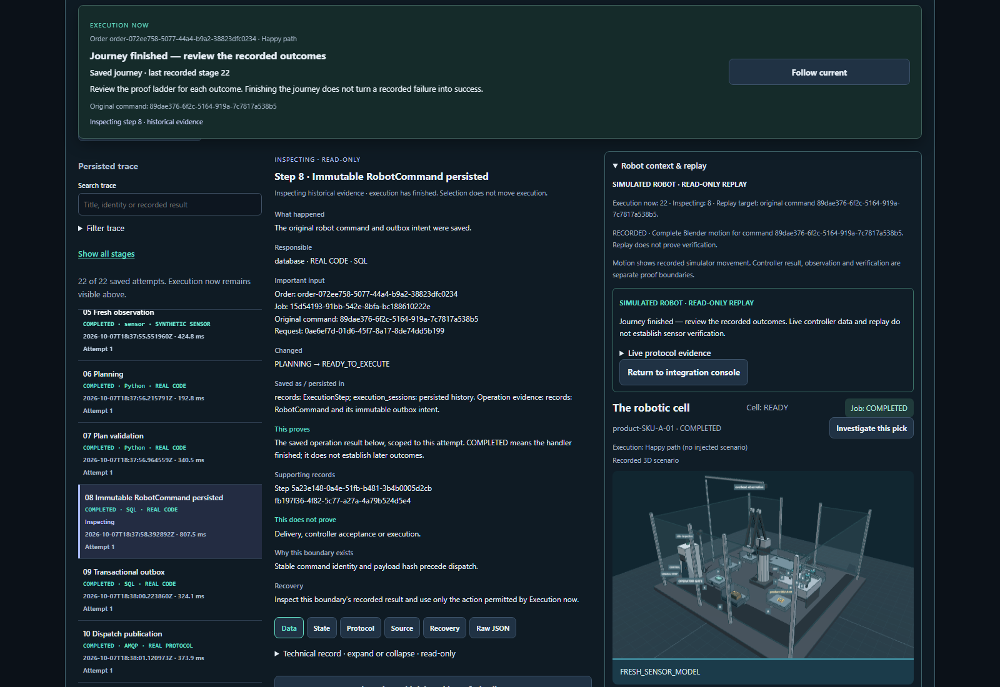
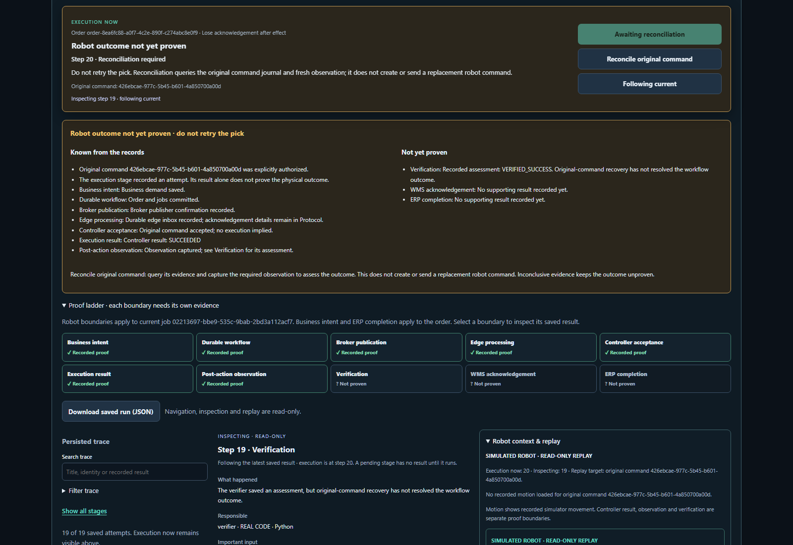
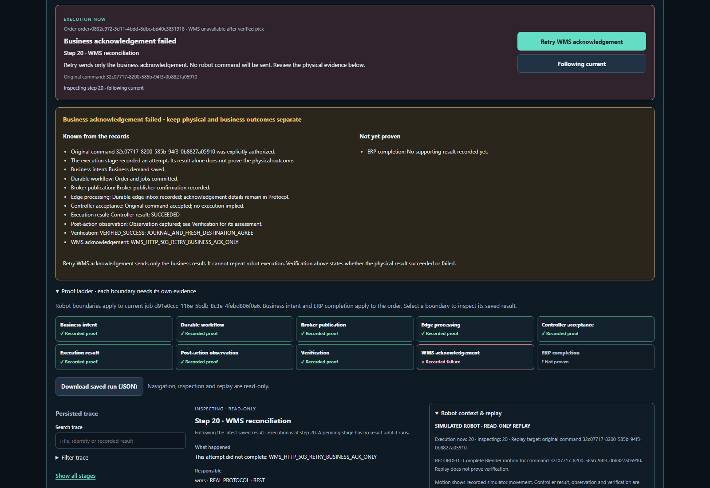

# Workbench review pack — 7 October 2026

This pack records the local evidence-centered workbench enhancement to baseline
`26d7aac9774d4f014e70da872dd4045d94428748`. It is not a new published release or a
claim that historical release CI ran against these uncommitted files.

Read the [implementation and acceptance report](../../implementation/evidence-workbench.md)
for behavior, changed components, contracts, test results, manual scenarios and
limits. [manifest.json](manifest.json) hashes the current source snapshot and
curated artifacts. [validation.json](validation.json) records the checked results.

## Screens reviewed

| Image | What it shows | Origin |
| --- | --- | --- |
| [Workbench overview](screens/workbench-overview.png) | Eight phases, persistent execution context, ten proof boundaries, saved-run export | Final live read-only review of completed manual A |
| [Physical authorization](screens/physical-gate.png) | Explicit consequence, original command, gate, unproven later outcomes and unavailable Blender recording | Local synthetic browser test; full-page capture |
| [Recorded robot, not yet verified](screens/happy-recorded-not-verified.png) | Same workspace with trace, meaning-first inspector and actual recorded Blender motion; execution waits at step 17 | Manual A |
| [Historical stage and 3D replay](screens/historical-run-review.png) | Inspecting step 8 in a completed older run while its original robot recording remains selected | Manual history review after replay-selection fix |
| [Unknown robot outcome](screens/lost-unknown.png) | Known/not-yet-proven facts, original-command reconciliation and no blind retry | Manual B before reconciliation |
| [Business acknowledgement failure](screens/wms-failed.png) | Verified physical outcome, failed WMS boundary and business-only retry | Manual C after HTTP 503 |
| [Mobile historical inspection](screens/mobile-history-wms-failure.png) | Execution step 20 versus inspecting step 19; sticky original command and Follow current at 390px | Manual C |
| [Business recovery complete](screens/wms-recovered.png) | Completed journey with the recovered proof ladder | Manual C after retry and ERP completion |

These are unmodified screenshots of actual browser states. Most manual desktop
images are 1600×1100; the mobile image is 390×844. Boundary screenshots were captured
during their actual scenario, not recreated by replacing live state. Minor final
trace-scroll/mobile polish and the historical replay-selection fix occurred after
some captures; final overview/history captures show the final loaded UI. Scenario
snapshots retain the exact evidence and status present at each boundary.

## Recorded data

- `manual-checks.json`: all three final statuses, original controller journals,
  one physical request per original command, WMS-only retry request and browser
  error list.
- `final-read-review.json`: final live health and matching session/job/replay
  identities after reload, with zero POSTs and no browser errors.
- `snapshots/happy-gate.json`, `happy-after-robot.json`, `happy-completed.json`:
  proof progression through authorization, robot execution and business completion.
- `snapshots/lost-unknown.json`, `lost-completed.json`: unresolved and reconciled
  original-command session/journal pairs.
- `snapshots/wms-failed.json`, `wms-completed.json`: actual failed HTTP response and
  recovered business outcome.
- `snapshots/happy-export.json`: actual saved-run UI download. Its scope explicitly
  excludes embedding referenced job records and motion files.
- `validation/`: UI output and raw backend, browser and contract JUnit results.
  The initial backend/contract file deliberately retains its stale-OpenAPI failure;
  the subsequent clean 68-case contract run proves the correction.
- `lab/`: four distributed browser scenario results, request/error logs and source
  hashes. The original larger traces, logs and images remain under their recorded
  `artifacts/lab-browser/` origins.

The manual lab used real PostgreSQL, RabbitMQ, OPC UA and REST with simulated
enterprise/controller/robot/sensor systems. All three manual robot movements used
Blender. This pack is evidence for simulator behavior and UI review, not production
hardware or certified safety validation.
