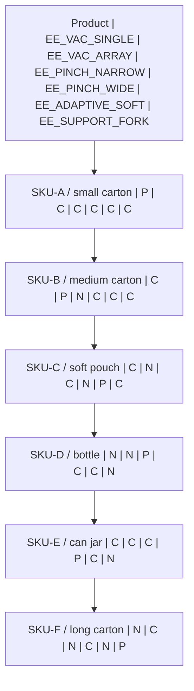

# Synthetic product and tool catalogue

Generated by `python -m tools.generate_robotics_docs` from [the runtime catalogue](../../robotops/robotics/catalogue-v1.json). Change that source and regenerate; do not maintain a separate compatibility matrix.

Classification: **SIMULATOR_DESIGN**. These fixtures and constraints are not manufacturer gripper specifications or customer product data. Catalogue availability does not by itself prove integrated scenario acceptance.

Profile `hkm_inspired_v1`; product catalogue `synthetic-products-1`; tool catalogue `synthetic-tools-1`; schema `2.0`.

## Product fixtures

| SKU / family | Dimensions (m) | Mass range (kg) | Preferred tool |
|---|---|---|---|
| SKU-A / small carton | 0.120 x 0.080 x 0.045 | 0.15-0.40 | EE_VAC_SINGLE |
| SKU-B / medium carton | 0.240 x 0.160 x 0.100 | 0.50-1.20 | EE_VAC_ARRAY |
| SKU-C / soft pouch | 0.180 x 0.120 x 0.040 | 0.08-0.35 | EE_ADAPTIVE_SOFT |
| SKU-D / bottle | 0.075 x 0.075 x 0.230 | 0.25-0.75 | EE_PINCH_NARROW |
| SKU-E / can jar | 0.090 x 0.090 x 0.120 | 0.30-0.80 | EE_PINCH_WIDE |
| SKU-F / long carton | 0.420 x 0.090 x 0.060 | 0.60-1.80 | EE_SUPPORT_FORK |

## Compatibility

P = preferred; C = candidate-compatible; N = disallowed. Mass, geometry and availability filters still apply to P/C candidates; a C entry alone does not guarantee that a particular fixture can be picked by that tool.

| Product | EE_VAC_SINGLE | EE_VAC_ARRAY | EE_PINCH_NARROW | EE_PINCH_WIDE | EE_ADAPTIVE_SOFT | EE_SUPPORT_FORK |
|---|---|---|---|---|---|---|
| SKU-A / small carton | P | C | C | C | C | C |
| SKU-B / medium carton | C | P | N | C | C | C |
| SKU-C / soft pouch | C | N | C | N | P | C |
| SKU-D / bottle | N | N | P | C | C | N |
| SKU-E / can jar | C | C | C | P | C | N |
| SKU-F / long carton | N | C | N | C | N | P |

## Synthetic tool limits

| Tool | Maximum simulated mass (kg) | Geometry rule | Collision envelope (m) |
|---|---|---|---|
| EE_VAC_SINGLE / Single suction cup | 0.80 | Flat top >= 0.050 x 0.050 m | 0.073 x 0.073 x 0.180 |
| EE_VAC_ARRAY / Multi-cup suction plate | 1.50 | Flat top >= 0.100 x 0.080 m | 0.180 x 0.130 x 0.180 |
| EE_PINCH_NARROW / Narrow parallel-jaw gripper | 1.00 | grasp width: 0.030-0.090 m | 0.150 x 0.075 x 0.213 |
| EE_PINCH_WIDE / Wide parallel-jaw gripper | 2.00 | grasp width: 0.070-0.260 m | 0.310 x 0.110 x 0.213 |
| EE_ADAPTIVE_SOFT / Adaptive soft-finger gripper | 0.90 | soft envelope: 0.050-0.140 m | 0.190 x 0.180 x 0.215 |
| EE_SUPPORT_FORK / Under-support fork | 2.00 | Synthetic under-clearance required | 0.463 x 0.160 x 0.215 |

## Operational envelope

The validator's synthetic envelope uses radius 1.55 m, TCP Z 0.16-1.15 m, and safe transfer Z 1.02 m. Frame `cell_world`, calibration `hkm-cal-1`.

Manufacturer public-reference metadata is separate and never replaces these simulator-owned validation limits. Motion timings are SIMULATOR_PRESENTATION_TIMING, not robot-performance measurements.
