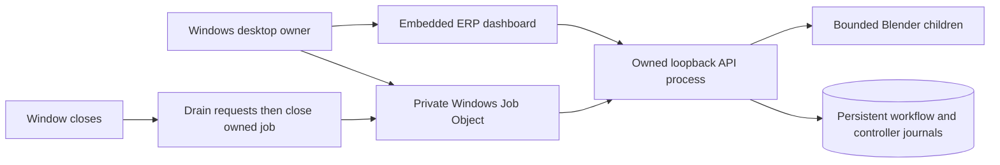

# Windows desktop app

The embedded dashboard uses dark mode and includes
[full 3D cell and per-scenario replay](playback.md). A persistent Next step guide
leads through Set up, Watch, Investigate and Continue. Jobs needing attention
highlight **Investigate this pick**; the cell remains visible until you open it.
The bounded panel separates symptom, confirmed evidence and possible explanation,
with Evidence and Manual inspection tabs. The timeline stays collapsed/bounded;
returning preserves your replay selection/frame. See the
[investigation walkthrough](investigation.md) and ADR 0012.
Both selectors also explain what each choice simulates, where it acts, and its
key difference from similar choices. Expand the comparison panels to read all
options in the same window. Execution choices apply to a new order; observation
choices apply to the next explicit review capture. See [scenario definitions](scenarios.md).
Close/reopen the app after updating this checkout to load the new backend and UI.
Saved orders remain intact. Older runs expose **Load saved animation**, which
exports their original `.blend` without executing another pick.
Use the permanent **Start new test** control for any new execution/observation
combination. **New simulation test** asks for **Robot cell**; **Create test** keeps
the fault selections and creates a fresh independent world in the same window.
The six-SKU HKM-inspired profile is the only selectable cell today. A fresh desktop data directory
uses that profile too. Reopening existing data retains its saved profile, including
the original three-product scene; choose Start new test to use the new cell without
changing historical evidence. **Test history** retains earlier outcomes, evidence and replay
read-only, including unknown and intervention states. Only running work blocks
creation; **Return to current test** resumes the active world. Changing a scenario
only configures the next order. Restock this test remains a separate guarded
operation for resolved jobs. The
default Full delivery replay spans all products already executed in that scene;
use Delivery replay to revisit a previous scene or select individual execution
details to inspect one product.

Under **Manage test data**, **Delete selected test** asks you to confirm removal of that test's orders,
observations, journal evidence and replay. The dialog identifies its test and
cell. **Clear all test data** identifies the current test count and confirms
removal of that displayed set. Cancel either dialog to keep everything unchanged.
These controls do not reconcile uncertain work or run a pick. A running operation
must finish before deletion. Deleting the active test or clearing all tests leaves
no active test; **Start new test** is the next explicit action. Retained
archives are never automatically made active.

Clear-all removes registered simulation worlds, not the app installation,
launcher sessions, browser profile or lifecycle catalog. Unrelated files remain.
Interrupted file cleanup is reported as pending and safely retried; a repeated
clear request cannot remove later-created tests. Closing/reopening the app does
not itself authorize deletion or recreate an empty active world. See
[data ownership and recovery](../adr/0011-cell-selection-and-test-data-lifecycle.md).
Lost acknowledgement pauses the next pick for every product. The investigation panel names the uncertain product and offers Reconcile [product]; choose Normal
observation to check the original command before creating another order. If the
evidence requires intervention, the panel offers **Observe again: [product]**.
Choose an observation mode and collect another assessment in the same test. Run stays
paused until sufficient evidence resolves the original command. Bad observations
can be repeated without freezing investigation, issuing another pick, or starting
a new test. Restart retains intervention until you explicitly request observation.

Double-click **RobotOps Twin** on the desktop. The native window starts its own
local API and opens the existing dashboard inside Microsoft Edge WebView2. Close
the window to stop the API and its Blender children. There is no tray service,
startup task, dependency installation or external model call when opening it.

This is a launcher for the installed checkout, like Asset Director's desktop host;
it is not a standalone bundle of Python and Blender. Keep the checkout and its
`.venv` in place. Windows x64, .NET Framework 4.8, the installed WebView2 Runtime,
the locked Python environment and Blender 5.2.1 LTS are required. Missing Blender
produces a visible startup error, never a silent headless substitution.

Build and install from repository-root PowerShell:

```powershell
powershell -NoProfile -ExecutionPolicy Bypass -File tools/build-desktop.ps1 -Install
```

The process-scoped execution-policy option allows this checked-in build script;
it does not change machine policy. The build downloads Microsoft.Web.WebView2
1.0.3800.47 from NuGet and verifies its pinned SHA-256 before compilation. Generated
EXE/DLLs, license, configuration and hash manifest are under
`artifacts/desktop/RobotOps Twin/`; they are not committed. Installation copies
them into a versioned directory under `%LOCALAPPDATA%\RobotOpsTwin\App` and updates
the desktop shortcut. An open older version keeps running; close and reopen via
the shortcut to load the new host. Earlier installed versions and data are retained.
The EXE is unsigned. Its DLLs must remain beside it; use the shortcut elsewhere.

Data survives closing and reopening:

- `%LOCALAPPDATA%\RobotOpsTwin\data`: orders, world, journals and Blender artifacts.
- `data\simulation-tests`: durable test catalog and separate worlds; startup
  recovers only the active world, preserving archived uncertainty.
- `%LOCALAPPDATA%\RobotOpsTwin\sessions`: startup, server and shutdown evidence.
- `%LOCALAPPDATA%\RobotOpsTwin\WebView2`: isolated profiles keyed by data root.

The native host opts into .NET/Windows long-path handling. Browser profiles stay
under a short LocalAppData path even when a checkout or custom data root is long;
this avoids Chromium profile-path limits. Top-level startup failures are also
recorded in `%LOCALAPPDATA%\RobotOpsTwin\launcher-error.log`.

Two launches for the same data root activate the same window. The backend binds
an OS-selected loopback port and publishes a session-specific ready file only
after startup. It never attaches to or stops a separately started API, browser or
Blender session. For a fresh independent fixture, launch the EXE with
`--data-root "C:\path\to\new-demo"`. `--runtime headless` explicitly selects the
fast synthetic adapter for development; normal desktop startup uses Blender.

Closing first requests graceful shutdown through a private session stop file.
It stops accepting requests and allows current work to drain for up to 65 seconds,
matching the runtime's 60-second deadline plus planning and persistence. Idle
shutdown returns promptly. After at most 70 seconds the owner closes its Windows
Job Object, terminating remaining owned
processes. The job also cleans up if the desktop crashes. A forced close may leave
an uncertain command, which remains subject to the existing lease, journal and
fresh-observation recovery rules. It does not declare success or retry a pick.
An unexpired lease can delay reconciliation after an abrupt shutdown.



Cross-platform backend tests run in the mandatory Python suite. The separate
Windows desktop workflow compiles the actual native host and runs
`powershell -NoProfile -ExecutionPolicy Bypass -File tools/test-desktop.ps1`:
actual WebView rendering, duplicate launch, normal window close, stopped port,
lost-ack restart and abrupt desktop termination. It uses the explicitly selected
headless adapter; mandatory Ubuntu acceptance still runs actual Blender. Local
`-Runtime blender` runs the same desktop lifecycle test with the installed Blender.

Ownership follows Microsoft's [Job Objects documentation](https://learn.microsoft.com/en-us/windows/win32/procthread/job-objects).
The child starts suspended and is assigned to the job before execution, preventing
an early descendant from escaping ownership. WebView2 uses an [isolated user data
folder](https://learn.microsoft.com/en-us/microsoft-edge/webview2/concepts/user-data-folder).
No generated code, API contract or observation boundary changes in this host.
