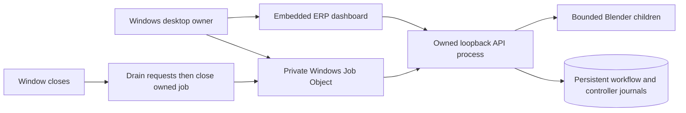

# Windows desktop app

Double-click **RobotOps Twin** on the desktop. The native window starts its own
local API and opens the existing dashboard inside Microsoft Edge WebView2. Close
the window to stop the API and its Blender children. There is no tray service,
startup task, dependency installation or external model call when opening it.

This is a launcher for the installed checkout, like Asset Director's desktop host;
it is not a standalone bundle of Python and Blender. Keep the checkout and its
`.venv` in place. Windows x64, .NET Framework 4.8, the installed WebView2 Runtime,
the locked Python environment and Blender 5.2.1 LTS are required. Missing Blender
produces a visible startup error, never a silent headless substitution.

Build and install from repository-root PowerShell:

```powershell
powershell -NoProfile -ExecutionPolicy Bypass -File tools/build-desktop.ps1 -Install
```

The process-scoped execution-policy option allows this checked-in build script;
it does not change machine policy. The build downloads Microsoft.Web.WebView2
1.0.3800.47 from NuGet and verifies its pinned SHA-256 before compilation. Generated
EXE/DLLs, license, configuration and hash manifest are under
`artifacts/desktop/RobotOps Twin/`; they are not committed. Installation copies
them into `%LOCALAPPDATA%\RobotOpsTwin\App` and creates a desktop shortcut.
The EXE is unsigned. Its DLLs must remain beside it; use the shortcut elsewhere.

Data survives closing and reopening:

- `%LOCALAPPDATA%\RobotOpsTwin\data`: orders, world, journals and Blender artifacts.
- `%LOCALAPPDATA%\RobotOpsTwin\sessions`: startup, server and shutdown evidence.
- `%LOCALAPPDATA%\RobotOpsTwin\WebView2`: isolated profiles keyed by data root.

The native host opts into .NET/Windows long-path handling. Browser profiles stay
under a short LocalAppData path even when a checkout or custom data root is long;
this avoids Chromium profile-path limits. Top-level startup failures are also
recorded in `%LOCALAPPDATA%\RobotOpsTwin\launcher-error.log`.

Two launches for the same data root activate the same window. The backend binds
an OS-selected loopback port and publishes a session-specific ready file only
after startup. It never attaches to or stops a separately started API, browser or
Blender session. For a fresh independent fixture, launch the EXE with
`--data-root "C:\path\to\new-demo"`. `--runtime headless` explicitly selects the
fast synthetic adapter for development; normal desktop startup uses Blender.

Closing first requests graceful shutdown through a private session stop file.
It stops accepting requests and allows current work to drain. After at most 20
seconds the owner closes its Windows Job Object, terminating remaining owned
processes. The job also cleans up if the desktop crashes. A forced close may leave
an uncertain command, which remains subject to the existing lease, journal and
fresh-observation recovery rules. It does not declare success or retry a pick.
An unexpired lease can delay reconciliation after an abrupt shutdown.



Cross-platform backend tests run in the mandatory Python suite. The separate
Windows desktop workflow compiles the actual native host and runs
`powershell -NoProfile -ExecutionPolicy Bypass -File tools/test-desktop.ps1`:
actual WebView rendering, duplicate launch, normal window close, stopped port,
lost-ack restart and abrupt desktop termination. It uses the explicitly selected
headless adapter; mandatory Ubuntu acceptance still runs actual Blender. Local
`-Runtime blender` runs the same desktop lifecycle test with the installed Blender.

Ownership follows Microsoft's [Job Objects documentation](https://learn.microsoft.com/en-us/windows/win32/procthread/job-objects).
The child starts suspended and is assigned to the job before execution, preventing
an early descendant from escaping ownership. WebView2 uses an [isolated user data
folder](https://learn.microsoft.com/en-us/microsoft-edge/webview2/concepts/user-data-folder).
No generated code, API contract or observation boundary changes in this host.
